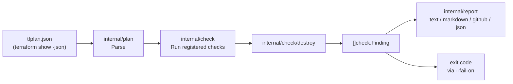
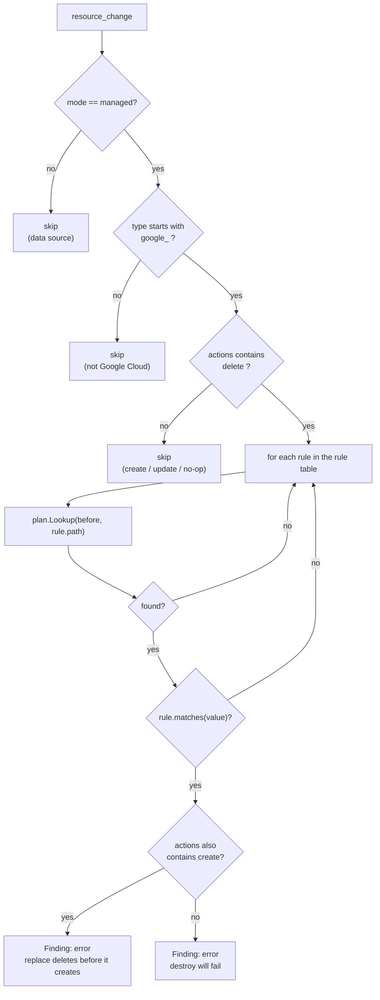
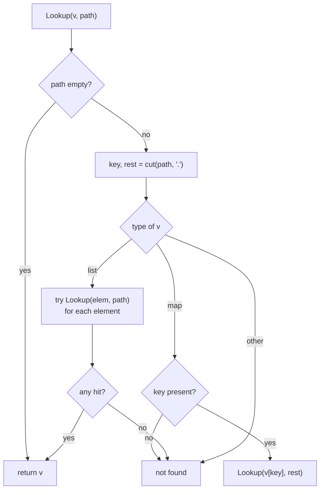
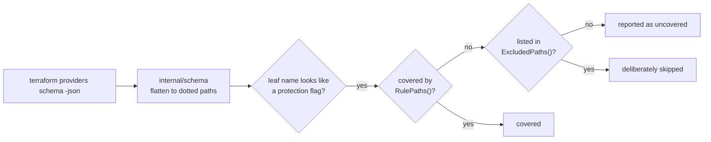

# Architecture

How the `destroy` check finds a deletion-protection field in a Terraform plan
and decides whether the apply will fail. For *why* the tool works this way, see
[design.md](design.md).

## The pipeline



Everything the checks see is the plan JSON. There is no call to the Google Cloud
API, no read of the HCL, and no state access.

## What the plan gives us

Only a small subset of `terraform show -json` output is decoded
(`internal/plan/plan.go`):

```json
{
  "resource_changes": [
    {
      "address": "google_sql_database_instance.main",
      "mode": "managed",
      "type": "google_sql_database_instance",
      "change": {
        "actions": ["delete"],
        "before": {
          "deletion_protection": true,
          "settings": [{ "deletion_protection_enabled": true }]
        },
        "after": null
      }
    }
  ]
}
```

Two things about this shape drive the rest of the design:

- **`before` is the value already in state.** Terraform deletes using that
  value, so the protection that blocks the API call is the one in `before`,
  never the one in `after`. A plan that sets `deletion_protection = false` *and*
  removes the resource still has `true` in `before`, and still fails.
- **A `MaxItems=1` block is rendered as a one-element list.** `settings` is an
  object in HCL and a list of one object in the plan, so path lookup has to
  handle both.

## Deciding on one resource change



A replace is `["delete", "create"]`, so it is caught by the same `delete` test
and only changes the wording of the message. Both are errors: the delete half of
a replace fails exactly like a plain destroy.

One resource change can produce more than one finding.
`google_sql_database_instance` carries two independent protections — the
Terraform-level `deletion_protection` and the API-level
`settings.deletion_protection_enabled` — and clearing one leaves the other
blocking, so each is reported on its own.

## Resolving a field path

`plan.Lookup` walks a dot-separated path through the decoded `before` object.
The one non-obvious rule is the list case: when the path hits a list, every
element is tried rather than the walk stopping there. That is what makes
`settings.deletion_protection_enabled` resolve against
`"settings": [{ "deletion_protection_enabled": true }]`.



Nested paths are declared explicitly in the rule table rather than searched for
recursively. A blind search would pick up
`google_backup_dr_restore_workload`'s
`compute_instance_restore_properties.deletion_protection`, which describes the
instance that workload will recreate — not a guard on deleting the workload.

## The rule table

Every entry is a **field name and the value that blocks a delete**, never a
resource type (`internal/check/destroy/destroy.go`):

| Path | Blocking value | Fix emitted with the finding |
| --- | --- | --- |
| `deletion_protection` | `true` | `deletion_protection = false` |
| `deletion_protection` | `"PROTECTED"` | `deletion_protection = "UNPROTECTED"` |
| `deletion_protection_enabled` | `true` | `deletion_protection_enabled = false` |
| `settings.deletion_protection_enabled` | `true` | `settings.deletion_protection_enabled = false` |
| `deletion_policy` | `"PREVENT"` | `deletion_policy = "DELETE"` |
| `delete_protection_state` | `"DELETE_PROTECTION_ENABLED"` | `delete_protection_state = "DELETE_PROTECTION_DISABLED"` |
| `delete_protection` | `true` | `delete_protection = false` |
| `enable_deletion_protection` | `true` | `enable_deletion_protection = false` |

`deletion_protection` appears twice because Bigtable spells the same field as an
enum rather than a boolean, so the name matches under two different value tests.

Because the table holds names, a resource type that gains deletion protection in
a future provider release is covered without a change here. The
`google_` prefix test exists for the same reason in reverse: these field names
also appear on AWS and Azure resources, which this tool does not claim to cover.

Each finding also carries the remediation `apply it before this change` —
clearing the protection and removing the resource cannot land in a single apply,
because Terraform deletes with the value already in state.

## Keeping the rule table honest

The rule table is only as good as the provider schema it was audited against, so
the audit is a tool rather than a memory (`tools/schemaaudit`):



```bash
go run ./tools/schemaaudit -schema schema.json -audit
```

A protection-shaped field that is neither in the rule table nor in
`ExcludedPaths()` is reported, which forces a decision to skip one to be
recorded in code rather than forgotten.

The same tool generates `internal/check/destroy/testdata/schema_shaped_plan.json`
with `-fixture`. Every field name, type and nesting level in that fixture is
resolved against a pinned provider schema before it is written, so the test
suite fails if this tool's idea of a plan diverges from the provider's. See
[the fixture's README](../internal/check/destroy/testdata/README.md) for how to
regenerate it.
