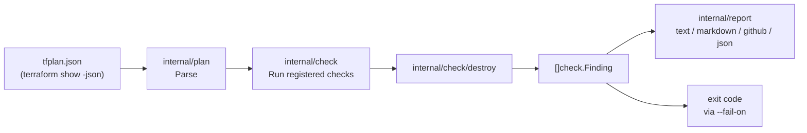
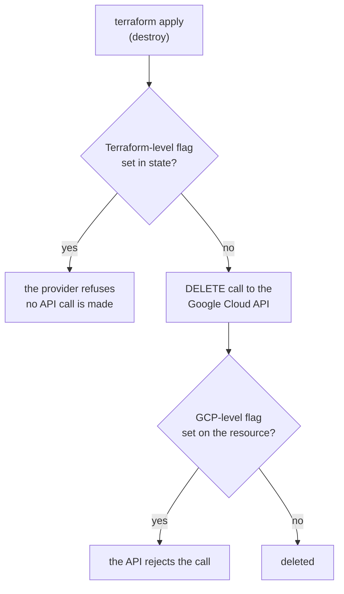
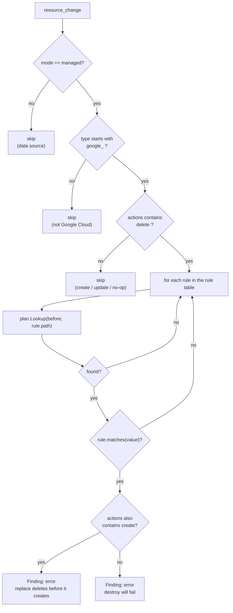
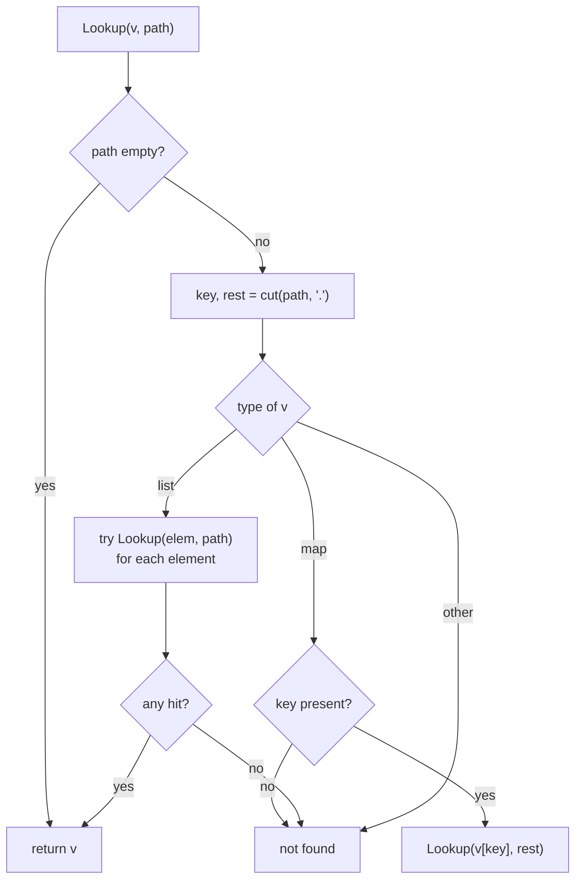
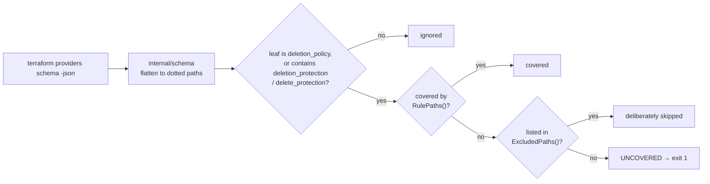

# Architecture

How the `destroy` check decides that an apply will fail, and what it depends on
upstream. For *why* the tool exists at all, see [design.md](design.md).

## The pipeline



Everything the checks see is the plan JSON. There is no call to the Google Cloud
API, no read of the HCL, no state access, and no provider schema — see
[Version drift](#version-drift-what-is-covered-and-what-is-not) for what that
buys and what it costs.

## Two kinds of deletion protection

"Deletion protection" on Google Cloud is two different mechanisms that happen to
be spelled with similar field names. Telling them apart is what makes the rest
of this document readable.



### Terraform-level (enforced by the provider)

The flag exists only in Terraform. The provider reads it out of state and
refuses to issue the delete; nothing is stored on the cloud resource, and
deleting through `gcloud` or the Cloud Console is unaffected. The provider is
explicit about this:

> This flag only protects instances from deletion within Terraform.
> — [`google_sql_database_instance.deletion_protection`](https://registry.terraform.io/providers/hashicorp/google/latest/docs/resources/sql_database_instance)

Examples: `google_container_cluster.deletion_protection` ("will only succeed if
this field is `false` in the Terraform state"), `google_bigquery_table`,
`google_cloud_run_v2_service`, `google_folder`, and every `deletion_policy =
"PREVENT"`.

### GCP-level (enforced by the Google Cloud API)

The flag is a property of the real resource. The API rejects the delete no
matter which surface issues it — Terraform, `gcloud`, the Console, or a direct
API call.

Examples: `google_sql_database_instance.settings.deletion_protection_enabled`
("across all surfaces (API, gcloud, Cloud Console and Terraform)"),
`google_compute_instance.deletion_protection`,
`google_bigtable_table.deletion_protection = "PROTECTED"`,
`google_firestore_database.delete_protection_state`, and
`deletion_protection_enabled` on Redis, Memorystore, Filestore and VMware
Engine.

### The level is a property of the resource, not of the field name

`deletion_protection` is Terraform-level on `google_bigquery_table` and
GCP-level on `google_compute_instance` — the same name, the same type, two
different enforcement points. The level cannot be derived from the name, so this
check does not try to derive it.

`google_sql_database_instance` carries one of each: the Terraform-level
`deletion_protection` and the GCP-level `settings.deletion_protection_enabled`.
Clearing one leaves the other blocking, which is why the check reports each
independently rather than one finding per resource.

### Why the check treats both the same

Both fail the same apply at the same point. Terraform has already destroyed the
resource's dependencies by the time it reaches the protected resource, so
whether the provider refuses locally or the API rejects the call, the outcome is
the children gone and the protected resource still standing. Both are therefore
reported as `error`.

### Where the difference does matter

| | Terraform-level | GCP-level |
| --- | --- | --- |
| Source of truth | Terraform state | the cloud resource |
| The plan's `before` is | exactly the value the provider will test | a copy of the API value, as of the last refresh |
| Can be changed without Terraform | no | yes, through `gcloud` or the Console |
| Verdict accuracy | exact | as fresh as the refresh |

A plan taken with `-refresh=false`, or a flag flipped between plan and apply,
can make a GCP-level verdict wrong in either direction: a finding for protection
that was already lifted, or — the dangerous one — silence for protection that
was turned on out of band. A Terraform-level verdict has no such gap, because
state is definitionally the thing the provider tests.

## What the plan gives us

Only a small subset of `terraform show -json` output is decoded
(`internal/plan/plan.go`):

```json
{
  "resource_changes": [
    {
      "address": "google_sql_database_instance.main",
      "mode": "managed",
      "type": "google_sql_database_instance",
      "change": {
        "actions": ["delete"],
        "before": {
          "deletion_protection": true,
          "settings": [{ "deletion_protection_enabled": true }]
        },
        "after": null
      }
    }
  ]
}
```

Two things about this shape drive the rest of the design:

- **`before` is the value already in state.** Terraform deletes using that
  value, so the protection that blocks the delete is the one in `before`, never
  the one in `after`. A plan that sets `deletion_protection = false` *and*
  removes the resource still has `true` in `before`, and still fails.
- **A `MaxItems=1` block is rendered as a one-element list.** `settings` is an
  object in HCL and a list of one object in the plan, so path lookup has to
  handle both.

## Deciding on one resource change



A replace is `["delete", "create"]`, so it is caught by the same `delete` test
and only changes the wording of the message. Both are errors: the delete half of
a replace fails exactly like a plain destroy.

## Resolving a field path

`plan.Lookup` walks a dot-separated path through the decoded `before` object.
The one non-obvious rule is the list case: when the path hits a list, every
element is tried rather than the walk stopping there. That is what makes
`settings.deletion_protection_enabled` resolve against
`"settings": [{ "deletion_protection_enabled": true }]`.



Nested paths are declared explicitly in the rule table rather than searched for
recursively. A blind search would pick up `google_backup_dr_restore_workload`'s
`compute_instance_restore_properties.deletion_protection`, which describes the
instance that workload will recreate — not a guard on deleting the workload.

## The rule table

Every entry is a **field name and the value that blocks a delete**, never a
resource type (`internal/check/destroy/destroy.go`):

| Path | Blocking value | Fix emitted with the finding | Enforced at |
| --- | --- | --- | --- |
| `deletion_protection` | `true` | `deletion_protection = false` | either level, depending on the resource |
| `deletion_protection` | `"PROTECTED"` | `deletion_protection = "UNPROTECTED"` | GCP (Bigtable) |
| `deletion_protection_enabled` | `true` | `deletion_protection_enabled = false` | GCP |
| `settings.deletion_protection_enabled` | `true` | `settings.deletion_protection_enabled = false` | GCP (Cloud SQL) |
| `deletion_policy` | `"PREVENT"` | `deletion_policy = "DELETE"` | Terraform |
| `delete_protection_state` | `"DELETE_PROTECTION_ENABLED"` | `delete_protection_state = "DELETE_PROTECTION_DISABLED"` | GCP (Firestore) |
| `delete_protection` | `true` | `delete_protection = false` | resource-specific |
| `enable_deletion_protection` | `true` | `enable_deletion_protection = false` | GCP (Workbench) |

`deletion_protection` appears twice because Bigtable spells the same field as an
enum rather than a boolean, so the name matches under two different value tests.

Because the table holds names, a resource type that gains deletion protection in
a future provider release is covered without a change here. The `google_` prefix
test exists for the same reason in reverse: these field names also appear on AWS
and Azure resources, which this tool does not claim to cover.

Each finding also carries the remediation `apply it before this change` —
clearing the protection and removing the resource cannot land in a single apply,
because Terraform deletes with the value already in state.

## Version drift: what is covered and what is not

The rule table is a bet on a set of **field names** published by
`hashicorp/google`. That bet is what makes the released binary independent of
which provider version you run: `tfgcpvalidator validate` reads a plan and
nothing else, so upgrading your provider never requires upgrading this tool for
the tool to keep working. What it can require is a new rule.

Here is every way the provider can move, and what happens:

| Upstream change | Example | Covered? | Noticed by |
| --- | --- | --- | --- |
| A new resource type carries a **known** field name | `google_alloydb_cluster` gained `deletion_protection` in 7.0.0 | **Yes**, immediately — no release of this tool needed | n/a |
| A known field's default flips to protective | 6.0.0 defaulted `deletion_protection = true` on Cloud Run v2, `google_folder` and `google_domain`; 7.0.0 defaulted `deletion_policy = "PREVENT"` on Secure Source Manager | **Yes** — and this is the case the tool exists for, since the flag arrives on the next refresh without anyone editing HCL | n/a |
| A **new field name** that still looks like protection (`*deletion_protection*`, `*delete_protection*`, `deletion_policy`) | a future `foo_deletion_protection` | **No**, until the rule table gains it | The schema audit fails, and a release closes the gap |
| A new field name that does **not** match that shape | a hypothetical `destroy_shield` | **No** | **Nothing.** The audit heuristic has to be widened by hand |
| A new blocking **value** on a known field | a third `deletion_policy` enum meaning "refuse" | **No** | **Nothing.** The audit compares names and types, never values |
| A known path changes type, e.g. `bool` to an enum | a Bigtable-style respelling of a boolean flag | Only if a rule already matches the new value | **Nothing.** The audit keys coverage on the path, so the path still reads as covered |
| A field is removed, or renamed away | — | The rule stops matching. No false positive; the dead rule is harmless | **Nothing.** The audit looks for uncovered fields, never for rules with nothing left to match |

The honest summary: **additive** provider changes are covered for free, and that
is the common case. **Renames, new spellings and new enum values** are gaps that
stay open until someone edits the rule table — silently, in the rows above that
say *Nothing*.

### How the audit narrows that window

`tools/schemaaudit` reads `terraform providers schema -json`, flattens every
resource type into dotted paths, and classifies every protection-shaped leaf:



`.github/workflows/schema-audit.yml` runs it weekly against the newest provider
release, so a newly published protection field surfaces as a failed audit rather
than as a missed finding in someone's pipeline. A field that is deliberately not
a rule has to be recorded in `ExcludedPaths()` with a reason; skipping one
without recording it fails the audit.

### Checking your own provider version

The weekly audit tracks the *latest* provider. If you pin an older one, or
upgrade the day a new major lands, you can run the same audit against exactly
the version you use. Write a `versions.tf` pinning your provider version, then:

```bash
terraform init -backend=false
terraform providers schema -json > schema.json
```

and, from a checkout of this repository:

```bash
go run ./tools/schemaaudit -schema schema.json -audit
```

Exit `0` means every protection-shaped field in that provider version is either
in the rule table or explicitly excluded. Exit `1` prints the uncovered paths
and the resource types carrying them — which is the signal to open an issue
here, and, until it is fixed, to treat those resource types as unguarded.

Pinning an older provider than the audit ran against is safe in the other
direction: rules for fields that version does not have simply never match.

### How much the names actually move

The bet is a reasonable one. Field names are part of the provider's public
interface — renaming one breaks every configuration that sets it, so it can only
happen at a major release with a migration note. The 6.0.0 and 7.0.0 upgrade
guides record protection fields being **added** to more resource types and their
**defaults** turning protective; neither guide renames or removes one. Between
6.44.0 and 7.41.0 the number of protection-bearing fields in the schema went
from 48 to 868, all under names already in the rule table.

That is evidence, not a guarantee, which is why the audit runs on a schedule
rather than being a one-time exercise.

## The test fixture

`tools/schemaaudit -fixture` also generates
`internal/check/destroy/testdata/schema_shaped_plan.json`. Every field name,
type and nesting level in that fixture is resolved against a pinned provider
schema before it is written, so the test suite fails if this tool's idea of a
plan diverges from the provider's. See
[the fixture's README](../internal/check/destroy/testdata/README.md) for how to
regenerate it and why the pinned version is recorded inside the file.
